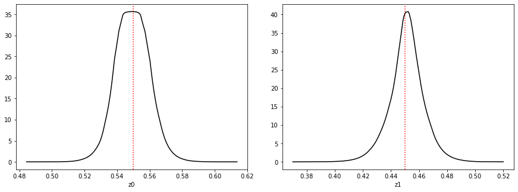
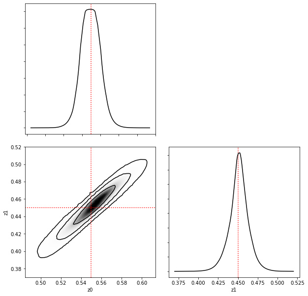

Quickstart with *swyft*
=====================

Example
------------------

As a quick example, the following code (1) defines a simple `simulator' and noise model (2) instantiates a sample cache in memory (3) trains a headless network to estimate likelihood ratios.
:: 
    DEVICE = 'cuda:0' #your gpu, or 'cpu' if a gpu is not available
    MAX_EPOCHS = 100 #maximum number of epochs per training round
    EXPECTED_N = 20000 #the average number of samples for the algorithm to see per training round
    
    #a simple simulator
    def simulator(z):
        return np.array([z[0],2*(z[1]-z[0])])
    #a simple noise model
    def noise(x, z = None, noise=0.01):
        n = np.random.randn(*x.shape)*noise
        return x + n
    #
    z0 = np.array([0.55,0.45])
    zdim = len(z0)
    x0 = simulator(z0)  # Using Asimov data
    
    #create cache in memory
    cache = swyft.MemoryCache(zdim = zdim, xshape = x0.shape)
    
    intensity = None

    for _ in range(4):
        if intensity is None:
            intensity = swyft.get_unit_intensity(expected_n=EXPECTED_N, dim=zdim)
        else:
            intensity = swyft.get_constrained_intensity(
                expected_n=EXPECTED_N,
                ratio_estimator=re,
                x0=x0,
                threshold=1e-4,
            )
        cache.grow(intensity)
        cache.simulate(simulator)
        points = swyft.Points(cache, intensity, noise)
        re = swyft.RatioEstimator(x0, points, device=DEVICE)
        re.train(max_epochs=MAX_EPOCHS, batch_size=32, lr_schedule=[1e-3, 3e-4, 1e-4])
  
The resulting 1-dimensional posteriors can be plotted:
::
    swyft.plot1d(re, x0 = x0, z0 = z0, cmap = 'Greys')
    

The 2-dimensional posterior is first trained:
::
    re2 = swyft.RatioEstimator(x0, points, combinations = [[0, 1]], device=DEVICE)
    re2.train(max_epochs=MAX_EPOCHS, batch_size=32, lr_schedule=[1e-3, 3e-4, 1e-4])

Allowing one to generate a classic triangle plot:
::
    swyft.corner(re, re2, x0 = x0, z0 = z0, cmap = 'Greys', dim = 10)
    

Usage in steps
-------------

Let's examine the above example in more detail.  First, we define a simulator function, which takes an
argument numpy vector :math:`z` and returns simulated data :math:`x`. We also define a noise model, which takes the output the simulator and adds noise. ::

    #a simple simulator
    def simulator(z):
        return np.array([z[0],2*(z[1]-z[0])])
    #a simple noise model
    def noise(x, z = None, noise=0.01):
        n = np.random.randn(*x.shape)*noise
        return x + n

We then use the model to generate mock observational data. ::

    z0 = np.array([0.55,0.45])
    zdim = len(z0)
    x0 = simulator(z0)  # Using Asimov data

Part of why *swyft* is so simulator-efficient is its sample cache. We instantiate an empty cache in memory.::

    cache = swyft.MemoryCache(zdim = zdim, xshape = x0.shape)
    
The cache can also live on your hard drive.::

    cache=swyft.DirectoryCache(zdim = zdim, xshape = x0.shape, path = "path/to/cache.zarr"):

The training loop then takes the following form.::

    intensity = None

    for _ in range(2):
        if intensity is None:
            intensity = swyft.get_unit_intensity(expected_n=EXPECTED_N, dim=zdim)
        else:
            intensity = swyft.get_constrained_intensity(
                expected_n=EXPECTED_N,
                ratio_estimator=re,
                x0=x0,
                threshold=1e-4,
            )
        cache.grow(intensity)
        cache.simulate(simulator)
        points = swyft.Points(cache, intensity, noise)
        re = swyft.RatioEstimator(points, device=DEVICE)
        re.train(max_epochs=MAX_EPOCHS, batch_size=32, lr_schedule=[1e-3, 3e-4, 1e-4])

The intensity function describes the Poisson process from which simulations are drawn from the cache. Initially all points are equally likely. In subsequent rounds, the ratio estimator is used to computed a constrained intensity, zooming into relevant regions of the parameter space. From the intensity function, the cache is grown (i.e. relevant points in parameter space are added) and simulator runs are evaluated. From the cache, points are drawn according to the intensity and noise is sampled for each simulation. 

The analysis is then started by invoking SWYFT as follows. ::

    from swyft import SWYFT

    sw = SWYFT(model, x0, zdim = 3)
    sw.run(nrounds = 3, nsamples = 5000)

This will call the simulator `model` around 15000 times, and sequentially zoom
into the parameter range that is consistent with mock data $x0$.  After
training, the 1-dim marginal posteriors can be plotted using ::

    from pylab import plot, show

    for i in range(zdim):
        z, p = sw.posterior(i)
        plot(z, p, label = i)
        axvline(z0[i])  # Comparison with true value
    show()

If, e.g., 2-dim posteriors for some of the parameter pairs are desired, they
can be generated simply as well. ::

    SWYFT.comb([[0, 1]])
    z, p = SWYFT.posterior([0, 1])

iP3 Data Caching
----------

(IN PROGRESS)

Simulator runs can be automatically re-used.  This is done by specifying the
cache when invoking `SWYFT` ::

    from swyft import MemoryCache, DirectoryCache

    ds = DirectoryCache(filename = 'ds.hdf5')

    sw = SWYFT(model, x0, zdim = 3, ds = ds)
    sw.run(nrounds = 3, nsamples = 5000)

This works just as above.  However, if we perform a similar analysis again
(with the same or other mock data), the number of simulator calls is, sometimes
greatly, reduced. ::

    # Rerunning does require less sampler runs
    sw = SWYFT(model, x1, zdim = 3, ds = ds)
    sw.run(nrounds = 3, nsamples = 5000)

Custom head networks
--------------------

(IN PROGRESS)

Input data is assumed to be vector-like.  Usually, vectors up to few hundred
values work well out-of-the-box.  For larger sets of data (images, volumetric
data, in general diverse data from various experiments), pre-processing is
required.  This is done using a `Head` network.  SWYFT comes with a range of
Head networks for typical use-cases, but those networks can be also custom made
and user-defined.  For image analysis problems, a simple convolutional neural network can be used. Invoking SWYFT with the head-network is shown below. ::

    from swyft import CNN

    sw = SWYFT(model, x0, zdim = 3, head = CNN)
    sw.run(nrounds = 3, nsamples = 5000)
